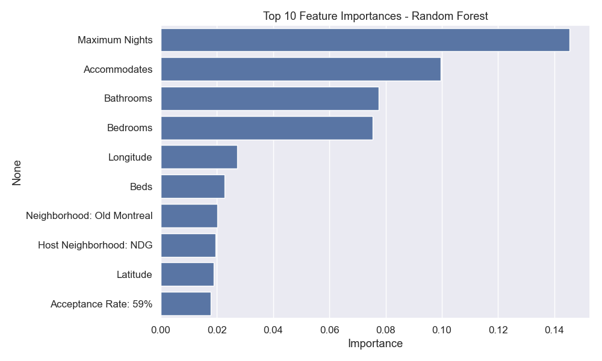
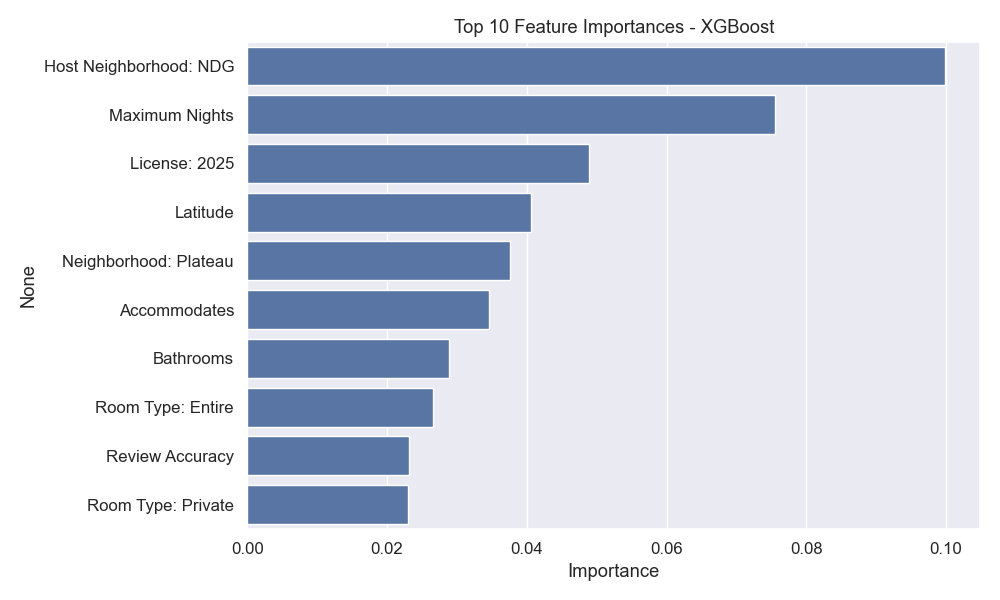

# Part I. Modelling
  
---
  
## 1. Data Wrangling (Montreal Q4 2024)

### 🎯 Variable Selection & Feature Engineering

This project aims to develop a predictive pricing model for Airbnb listings in Montreal. The selection and transformation of variables were guided by three core principles:

- **Relevance** to pricing decisions, from both the guest's and host's perspectives
- **Availability** and consistency across the main and validation datasets
- **Predictive power**, to be further assessed through modeling and importance analysis

### 🏷 Target Variable
- `price`: The nightly listing price in Canadian dollars (CAD)  
  - Originally a string (e.g., `"$1,234.00"`), it was cleaned using regular expressions and converted to numeric format
  - Rows with missing or zero prices were excluded from the analysis

### 📥 Predictor Variables
Predictors were selected based on domain knowledge, literature, and data structure. Categories include:

| Feature Group        | Examples                                                   |
|----------------------|------------------------------------------------------------|
| **Host characteristics** | `host_location`, `host_response_rate`, `host_acceptance_rate` |
| **Property attributes**  | `room_type`, `accommodates`, `beds`, `bathrooms`, `minimum_nights` |
| **Geographic location**  | `neighbourhood_cleansed`, `latitude`, `longitude`              |
| **Reputation metrics**   | `review_scores_rating`, `number_of_reviews`, `reviews_per_month` |
| **Amenities**            | 10 most frequent amenities, parsed from text as binary indicators |

### 🛠 Data Wrangling & Transformation

#### 📂 Initial Cleaning
- Removed columns with **100% missing values**, such as `neighbourhood_group_cleansed`, `calendar_updated`
- Cleaned and converted the `price` column from string to float
- Excluded rows with missing `price`

#### 🧩 Amenities Parsing
The `amenities` column consisted of unordered strings describing listing features. To incorporate this:

1. Special characters (braces, quotes) were removed
2. The string was split by commas
3. Dummy variables were created for each amenity
4. The **top 10 most frequent amenities** were selected and merged into the dataset:

   - `Smoke alarm`, `Kitchen`, `Hot water`, `Dishes and silverware`, `Cooking basics`
   - `Hangers`, `Refrigerator`, `Essentials`, `Bed linens`, `Microwave`

#### 🔍 Handling Missing Data
- Columns with all values missing were dropped
- Listings with missing `price` were excluded
- Other missing values were left as-is for now; model-specific handling will follow (e.g., tree models can split on missing values)

#### 🗑 Column Reduction
Redundant and metadata columns were removed to improve clarity and reduce noise:
- Listing IDs and URLs
- Host profile images, biographies
- Calendar scraping timestamps

This ensured a cleaner dataset with minimal irrelevant information.

#### ✅ Summary of Cleaned Dataset
- **Observations**: 9,481
- **Variables**: 63 (including engineered binary amenities)

#### Dataset Source
- InsideAirbnb — Montreal Q4 2024 listings  
  **Link**: [Montreal CSV](https://raw.githubusercontent.com/AlikCEU/Prediction-with-ML-2-HW/main/montreal%20q4.2024.csv)

---

## 2 & 3. Modeling and Comparison (Tasks 2 & 3)

### 🧪 Experimental Design and Pipeline Justification

To evaluate multiple predictive approaches for Airbnb pricing, we implemented a consistent machine learning pipeline structure with model-specific variation. The dataset was randomly split into an 80% training and 20% test set to allow for fair out-of-sample performance assessment.

### 📁 Why Train-Test Split?
The train/test split simulates a real-world prediction setting, where models must generalize to unseen listings. By training only on the training set and evaluating performance on the holdout set, we avoid overfitting and obtain unbiased estimates of predictive accuracy.

### ⚙️ Preprocessing Pipelines
We implemented **modular pipelines** for reproducibility, clarity, and to ensure that all models received identical inputs.

- **Numerical Features**: Missing values were imputed using the **median** to reduce the influence of outliers.
- **Categorical Features**: Imputed using the **most frequent category**, followed by **one-hot encoding** to transform them into numerical format.
  - One-hot encoding was necessary because most models (e.g., OLS, LASSO, XGBoost) cannot directly interpret categorical text.
  - The `handle_unknown="ignore"` parameter in `OneHotEncoder` ensured robustness to categories unseen during training.

This preprocessing strategy ensured that all models started from a clean and comparable feature space, and helped standardize evaluation.

### 🧠 Models Evaluated
We compared five models, chosen to represent a spectrum of complexity and flexibility:

| Model              | Description                                                                 |
|-------------------|-----------------------------------------------------------------------------|
| **OLS**           | Benchmark linear regression, assumes linear relationship and no interactions |
| **LASSO**         | Linear model with L1 regularization for feature selection                     |
| **CART**          | Regression tree allowing non-linearity and automatic interactions             |
| **Random Forest** | Ensemble of trees reducing overfitting via bootstrap aggregation              |
| **XGBoost**       | Gradient boosting, powerful ensemble with regularization and fine-tuning     |

### 📊 Model Performance Summary

| Model          | RMSE    | R²      | MAE    | Time (s) |
|----------------|---------|---------|--------|----------|
| OLS            | 203.22  | 0.0011  | 82.29  | 0.08     |
| LASSO          | 203.36  | -0.0003 | 82.51  | 25.37    |
| CART           | 164.11  | 0.3486  | 58.70  | 0.92     |
| Random Forest  | 144.33  | 0.4961  | 46.45  | 9.67     |
| XGBoost        | 151.38  | 0.4457  | 50.39  | 0.30     |

### 📈 Interpretation of Results

- **OLS and LASSO** yielded the highest RMSE (203.22 and 203.36) and near-zero or negative R² values (0.0011 and -0.0003, respectively). This indicates that these linear models **failed to explain any meaningful variance** in the price variable. Their assumption of linearity likely does not hold in this dataset, which contains complex, non-linear relationships.

- **LASSO**, while designed to perform variable selection and regularization, offered **no practical performance gain** over OLS and took considerably longer to run (25.37 seconds), largely due to internal cross-validation for tuning its regularization parameter.

- **CART** significantly outperformed the linear models, achieving an R² of **0.3486** and reducing RMSE to **164.11**. This suggests that decision trees are better suited to capturing non-linearities and variable interactions. However, despite this improvement, the model still leaves a large portion of the variance unexplained. Compared to ensemble methods, CART performs worse in both RMSE and R², indicating potential **overfitting** to patterns in the training data that do not generalize well. This behavior is characteristic of deep, unpruned trees that closely follow noise or rare patterns.

- **Random Forest** delivered the best performance: **lowest RMSE (144.33)**, **highest R² (0.4961)**, and **lowest MAE (46.45)**. This reflects the advantage of aggregating multiple decorrelated trees, which **reduces variance and improves generalization**. Its runtime of 9.67s is reasonable given its complexity.

- **XGBoost** also showed strong performance with an RMSE of **151.38** and R² of **0.4457**, **very close to Random Forest**, but with a significantly **faster runtime (0.30s)**. While it slightly underperformed in terms of raw accuracy, XGBoost provides additional tuning options and scalability that may prove advantageous in future iterations. **Random Forest and XGBoost**—demonstrate clear superiority in predicting Airbnb prices in Montreal. These models capture the heterogeneous and non-linear nature of short-term rental data far better than linear approaches.

- **OLS and LASSO** performed poorly, suggesting that linear models struggle to capture non-linearities in the data.
- **CART** improved performance but tends to overfit.
- **Random Forest** achieved the best performance in terms of RMSE and R², followed closely by **XGBoost**, with slightly faster training time.

These findings suggest that ensemble tree-based models are more appropriate for Airbnb pricing, given the complexity and heterogeneity in listings.

---

## 4. Feature Importance

### 🔍 Top Predictors by Model

Below are the corresponding visualizations of the top 10 feature importances from both models:

To further understand the drivers of Airbnb prices, we examined feature importances from the two best-performing models: **Random Forest** and **XGBoost**. Both models provide intrinsic feature importance metrics, indicating which variables were most influential in prediction.

### 🌳 Random Forest – Top 10 Features
| Rank | Feature                    | Importance |
|------|----------------------------|------------|
| 1    | Maximum Nights             | 0.145      |
| 2    | Accommodates               | 0.100      |
| 3    | Bathrooms                  | 0.077      |
| 4    | Bedrooms                   | 0.075      |
| 5    | Longitude                  | 0.027      |
| 6    | Beds                       | 0.023      |
| 7    | Neighborhood: Old Montreal| 0.020      |
| 8    | Host Neighborhood: NDG     | 0.019      |
| 9    | Latitude                   | 0.019      |
| 10   | Acceptance Rate: 59%       | 0.018      |

### ⚡ XGBoost – Top 10 Features
| Rank | Feature                  | Importance |
|------|--------------------------|------------|
| 1    | Host Neighborhood: NDG   | 0.100      |
| 2    | Maximum Nights           | 0.076      |
| 3    | License: 2025            | 0.049      |
| 4    | Latitude                 | 0.041      |
| 5    | Neighborhood: Plateau    | 0.038      |
| 6    | Accommodates             | 0.035      |
| 7    | Bathrooms                | 0.029      |
| 8    | Room Type: Entire        | 0.027      |
| 9    | Review Accuracy          | 0.023      |
| 10   | Room Type: Private       | 0.023      |

### 🧠 Interpretation
- **Maximum Nights** appears highly influential across both models, especially in Random Forest. This suggests that listings with higher maximum stay durations may command premium pricing or signal flexible rental policies.
- **Accommodates**, **Bedrooms**, and **Bathrooms** consistently rank high, confirming that **capacity and size** are key price drivers.
- **Location variables** like **Host Neighborhood: NDG**, **Latitude**, and **Neighborhood: Old Montreal/Plateau** highlight the strong spatial patterns in pricing.
- XGBoost assigns relatively more importance to **categorical policy and review fields**, such as `License: 2025`, `Room Type`, and `Review Accuracy`, possibly reflecting its finer handling of subtle effects and interaction terms.

Overall, both models emphasize a blend of **capacity-related, geographic, and listing-specific features**—but XGBoost slightly favors structured/categorical information while Random Forest leans more heavily on numerical magnitude.

### 📊 Visual Comparison

*Figure 1. Top 10 Feature Importances – Random Forest.*

*Figure 2. Top 10 Feature Importances – XGBoost.*

---

# Part II. Validity

---

## 5. Wrangling Live Datasets

To assess the external validity of our models, we process and evaluate two additional datasets:

- **A. Montreal Q1 2025** — to evaluate temporal generalization within the same city
- **B. Ottawa Q1 2025** — to evaluate spatial generalization across cities

### 🔹 Part A: Montreal Q1 2025

- **Rows**: 8,955
- **Columns**: 67
- **Top 10 amenities**:
  - Smoke alarm, Wifi, Hot water, Kitchen, Dishes and silverware,
  - Cooking basics, Refrigerator, Hangers, Bed linens, Essentials

The same wrangling procedure as in Q4 was applied:
- Dropped empty and irrelevant columns
- Converted `price` to numeric
- Parsed and binarized the top 10 most frequent amenities
- Saved the cleaned file as `montreal_q1_cleaned.csv`

### 🔹 Part B: Ottawa Q1 2025

- **Rows**: 2,535
- **Columns**: 67
- **Top 10 amenities**:
  - Smoke alarm, Kitchen, Wifi, Carbon monoxide alarm, Hangers,
  - Microwave, Hot water, Essentials, Hair dryer, Bed linens

Similar cleaning steps were performed:
- Removed unused columns and handled missing `price`
- Processed amenities into binary features
- Saved the cleaned dataset as `ottawa_q1_cleaned.csv`

These datasets are now ready for model testing in the next section.

---

## 6. Model Evaluation on Validation Sets

We now assess how well our five core models generalize to the two validation datasets. Performance is evaluated using the same metrics: RMSE, R², MAE, and runtime.

### 📅 Montreal Q1 2025 Results

| Model          | RMSE    | R²      | MAE    | Time (s) |
|----------------|---------|---------|--------|----------|
| OLS            | 133.42  | 0.2350  | 73.51  | 0.01     |
| LASSO          | 190.24  | -0.5554 | 57.48  | 33.77    |
| CART           | 138.36  | 0.1772  | 68.01  | 0.09     |
| Random Forest  | 107.33  | 0.5049  | 31.08  | 54.76    |
| XGBoost        | 113.29  | 0.4484  | 34.70  | 0.24     |

### 🏙️ Ottawa Q1 2025 Results

| Model          | RMSE       | R²           | MAE        | Time (s) |
|----------------|------------|--------------|------------|----------|
| OLS            | 3,722,267.74 | -1.52e+09     | 187,328.32 | 0.02     |
| LASSO          | 2,339,137.80 | -6.01e+08     | 130,695.44 | 4.25     |
| CART           | 291.31       | -8.3290       | 61.62      | 0.04     |
| Random Forest  | 83.12        | 0.2405        | 38.76      | 9.15     |
| XGBoost        | 100.28       | -0.1054       | 39.38      | 0.16     |

### 🔍 Interpretation

#### Internal Validity
In the Montreal Q1 2025 results, Random Forest and XGBoost continue to show strong internal validity:
- Random Forest achieves an R² of 0.5049.
- XGBoost is slightly lower at 0.4484.
- Linear models (OLS and LASSO) perform poorly, with LASSO producing a negative R².

These outcomes confirm that the pipeline and model selection process maintain predictive performance within the same city.

#### External Validity
In Ottawa Q1 2025, we observe a significant drop in model performance:
- Random Forest remains the most reliable with an R² of 0.2405.
- XGBoost shows degradation (R² = –0.1054), and linear models fail entirely.

This performance drop highlights spatial generalization challenges—pricing dynamics and distributions likely differ between cities. These findings highlight the challenge of spatial generalization and the importance of city-specific model calibration when deploying pricing models across heterogeneous markets.
- In **Montreal Q1**, results are largely consistent with Q4. Overall, Random Forest—followed by XGBoost—consistently demonstrates the most robust generalization across both time and location. CART and linear models decline slightly in performance, with LASSO showing instability (R² < 0).
- In **Ottawa Q1**, **Random Forest remains the best model**, though all others struggle. OLS and LASSO completely break down, suggesting that linear assumptions and over-regularization fail to transfer across cities. XGBoost performs acceptably but with weaker generalization compared to RF.

These results reinforce the robustness of tree-based ensemble models, especially Random Forest, in real-world deployment scenarios where both time and location shift.

---

## 7. Discussion & Recommendations

The modeling results across both temporal and spatial validation exercises demonstrate a clear advantage for tree-based ensemble models, particularly Random Forest. This model consistently outperformed others in both Montreal and Ottawa test sets, indicating a strong degree of robustness under moderate domain shift.

While XGBoost showed competitive performance in Montreal, its generalization to Ottawa was weaker. Linear models, especially LASSO, failed under both temporal and spatial validation, confirming that linear assumptions do not capture the complexity of pricing mechanisms in the Airbnb market.

Feature importance analysis supports the idea that key predictors—such as maximum stay length, location coordinates, number of rooms, and room type—are interpretable, consistent, and highly informative. However, even top-performing models show a drop in external validity, underlining the importance of localized model retraining or domain-specific tuning.

From a business perspective, we recommend:
- Prioritizing **Random Forest** as the default pricing engine due to its stable performance
- Performing **quarterly model updates** using the latest available data
- Applying **city-specific retraining** when entering new markets
- Monitoring **feature drift** to ensure model assumptions remain valid over time

In conclusion, ensemble tree-based models offer a reliable and interpretable approach to dynamic pricing in the short-term rental market, provided their use is grounded in continual validation and adaptation.

  
## Appendix
- Code written in Python 3.9
- All data fetched via public GitHub links
- Models evaluated using scikit-learn and XGBoost
- Visualizations generated using seaborn and matplotlib
